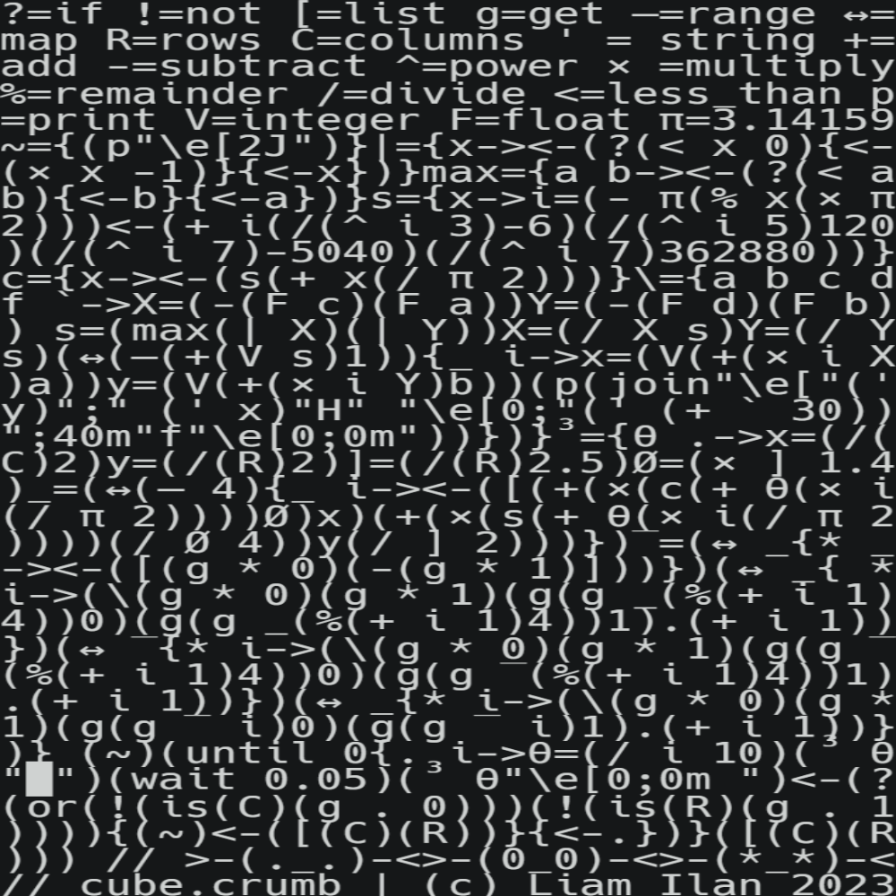
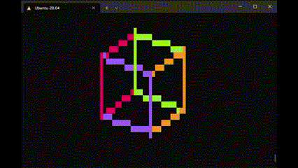

# cube.crumb
A cube wireframe renderer, in a 34x34 [Crumb](https://github.com/liam-ilan/crumb) script.

inspired by [donut.c](https://www.a1k0n.net/2006/09/15/obfuscated-c-donut.html) and [cube.py](https://github.com/liam-ilan/python-cube).

*Figure 1. Code*

*Figure 2. Result*

## Development
Run with `./crumb cube.crumb`
- The obfuscated code can be found at [`cube.crumb`](./cube.crumb) (34 x 34 chars)
- The unobfuscated version can be found at [`unobfuscated-cube.crumb`](./unobfuscated-cube.crumb)
- The one liner version can be found at [`unobfuscated-cube.crumb`](./one-liner-cube.crumb) (1094 chars)